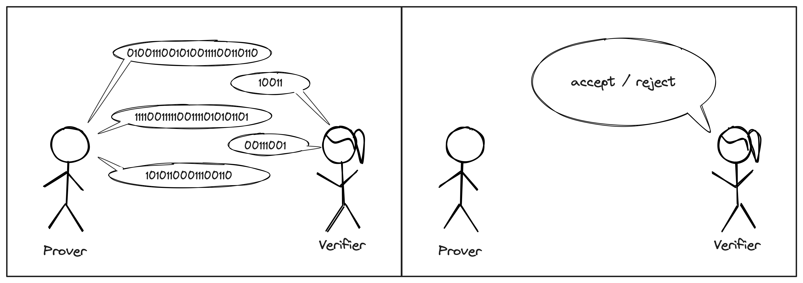
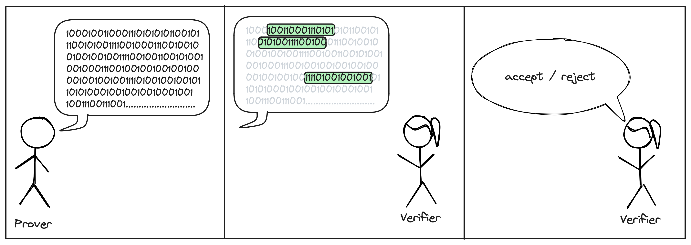

# Introduction to ZK Jargon

---

## Part 2: Probabilistic and Interactive Proofs

In the [previous article](./what_is_proving.md), we covered what "proving" means, established some necessary vocabulary and finally discussed the trivial proof system: sending the [witness](./what_is_proving.md#relations).
As discussed, this is not always desirable.
Sometimes the witness is private and should remain so.
Other times, the witness is just too big to be sent or for the Verifier to process.

In this article, we look at two techniques to build more elaborate proof systems: 
- the first is to allow the Verifier to "ask multiple questions", i.e. to **interact with the Prover**; 
- the second is to allow the Verifier to **not read the whole proof**.

Naturally, if the proof is shorter than the witness or it is some randomized version of it, the Verifier might sometimes accept proofs for `FALSE` statements.
This is acceptable (!), as long as it only happens with a small probability.
We call this probability the **soundness error** (see [Soundness](../definitions/soundness.md)).

### 1. Asking multiple questions
The first technique can be understood as "asking multiple questions".
Rather than sending the witness as a single message, the Prover and Verifier can **interact** over multiple rounds.
This forces the Prover to stay consistent: once something is said, it cannot be unsaid; and any contradiction between the Prover's messages can be used against him.

Proof systems that use this paradigm are known as **interactive proofs (IP)**.

In practice, we much prefer non-interactive proofs.
Luckily, if an IP is such that the Verifier's messages are all sampled at random from a uniform distribution, **there are techniques to transform the IP into a non-interactive proof** (e.g., the [Fiat-Shamir Transform](../definitions/fiat_shamir.md)).

### 2. Not reading the full proof
The second technique is to not read the full proof.
Instead, the Verifier will **query the proof** at location of her choice.
The locations are usually chosen at random after the Prover sent his message.

Proof systems that use this paradigm are known as **probabilistically checkable proofs (PCP)**.

Note that for PCPs to make sense, we need a way for the Prover to send his message, without requiring the Verifier to read it in full. 
When working on theoretical systems, we allow the Prover to send an [oracle](../definitions/oracle.md) for his proof.
In this context, an oracle is a black-box that stores the proof string and can be queried at any index.
**To turn these into real-world systems, we implement the oracle with a commitment scheme.**

### 3. Combining both
Of course, we can combine the two above techniques.
The resulting proof systems are known as **interactive oracle proofs (IOP)**.

Interestingly, IOPs are not more powerful than PCPs.
Everything that can be proven by an IOP can also be proven by a PCP.
However, they yield more efficient protocols in practice.

## How is this related to my SNARKs?
Our favorite recipe to build a SNARK is as follows: **we start with an IOP, replace the theoretical oracles with commitments, and then remove interaction by using the Fiat-Shamir transform**.
The SNARK "proof" is a collection of commitments to the Prover's messages, the values of the IOP messages at the locations queried by the Verifier, and some extra information to convince the Verifier that the values do correspond to the committed strings.

For a formal treatment of these techniques, please see the *excellent* free online book [*Building Cryptographic Proofs from Hash Functions*](https://snargsbook.org) by Chiesa and Yogev.

## References
See ''Bibliographic Notes" in Chiesa and Yogev's [*Building Cryptographic Proofs from Hash Functions*](https://snargsbook.org).

---
*Cartoons created in [Excalidraw](https://plus.excalidraw.com) by Nicolas Mohnblatt, using the Stick Figures collection by [Youri Tjang](https://github.com/youritjang) and the Speech Bubbles collection by [Oscar Capraro](https://www.grepper.com/app/profile.php?id=44392).*

